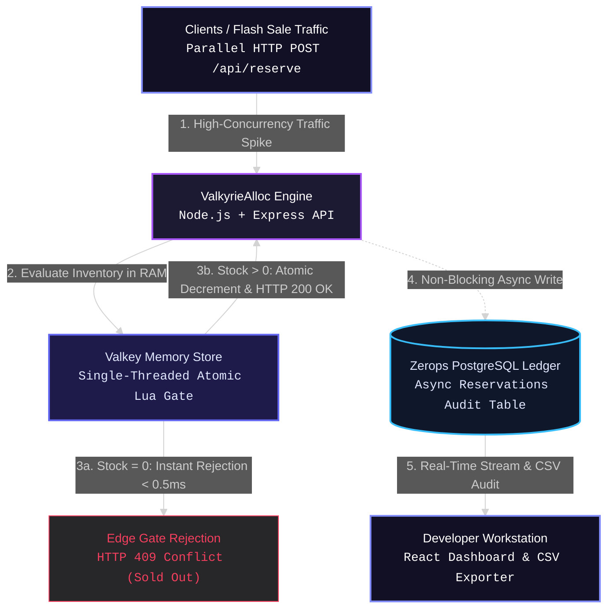

# ValkyrieAlloc

Zerops-Native Sub-Millisecond In-Memory Allocation Gate.
Intercept high-traffic checkout spikes in RAM before they touch relational databases. Atomic Lua evaluations run stock decrements in memory with complete race-condition protection.

[](https://zerops.io/)
[](https://valkey.io/)
[](https://nodejs.org/)
[](https://www.postgresql.org/)
[](https://react.dev/)
[](LICENSE)

---

## The Problem: Flash Sale Infrastructure Collapse

When high-demand drops occur (sneaker drops, event tickets, flash sales), tens of thousands of users submit purchase requests within the exact same millisecond. 

Standard relational databases (PostgreSQL, MySQL) fail under this specific concurrency pattern:
- **Row-Level Lock Contention:** Every incoming transaction attempts to execute SELECT FOR UPDATE on the stock record. Database connection pools get rapidly exhausted.
- **Over-Allocation Defects (Race Conditions):** Naive read-then-write application logic allows multiple parallel requests to read stock = 1 simultaneously, resulting in double-selling items.
- **Server Crashes:** Database CPU and RAM spike to 100%, taking down non-checkout services across the entire platform.

---

## The Solution: ValkyrieAlloc

ValkyrieAlloc sits in front of your database as an isolated, sub-millisecond allocation gate. 

Instead of routing checkout traffic directly to disk-backed storage, requests hit a single-threaded Valkey (RAM) instance running atomic Lua evaluations. 

- **Sub-Millisecond Execution (< 0.5 ms):** In-memory evaluations determine stock availability instantly without acquiring SQL locks.
- **Zero Race Conditions:** Valkey executes Lua scripts atomically in a single thread—eliminating race conditions and over-allocation defects entirely.
- **Non-Blocking Persistence:** Once stock is secured in RAM, approved claims are written asynchronously to PostgreSQL in the background. Excess traffic is rejected instantly at the edge with HTTP 409 Conflict.

---

## System Architecture

1. **Client / Checkout Request:** Incoming POST requests sent to `/api/reserve`.
2. **In-Memory Gate (Valkey):** Single-threaded atomic Lua script checks and decrements RAM stock.
   - **If Stock Available:** Decrements integer in memory, returns `HTTP 200 OK` in < 0.5 ms.
   - **If Stock Exhausted:** Returns `HTTP 409 Conflict` instantly.
3. **Async Persistence (PostgreSQL):** Approved claims queue a non-blocking background write to the PostgreSQL `reservations` audit ledger.



---

## Tech Stack & Infrastructure

- **Runtime:** Node.js (Express)
- **In-Memory Store:** Valkey (Redis-compatible RAM engine)
- **Relational Database:** PostgreSQL (Async reservation logging)
- **Frontend Workstation:** React + Vite + Tailwind CSS + Framer Motion
- **Cloud Orchestration:** Native Zerops deployment (zerops.yaml)
  
## Integrating ValkyrieAlloc into Your Zerops Infrastructure

Deploy a high-availability ValkyrieAlloc engine instance directly into your Zerops project in under 5 minutes using native Zerops orchestration.

### Step 1: Provision Zerops Services
In your Zerops project dashboard, create the three core infrastructure services:
1. **Node.js Runtime Container** (Service Name: `api`) – Houses the ValkyrieAlloc execution engine.
2. **Valkey Memory Store** (Service Name: `valkey`) – Provides in-memory atomic Lua execution.
3. **PostgreSQL Database** (Service Name: `db`) – Serves as the asynchronous audit ledger.

### Step 2: Configure Native Zerops Orchestration (`zerops.yaml`)

Place this `zerops.yaml` file in your repository root. Zerops reads this manifest automatically to build, cache, wire internal service environments, and start the engine:

```yaml
zerops:
  - setup: api
    build:
      base: nodejs@20
      buildCommands:
        - npm install
        - npm run build
      deployFiles: ./
      cache:
        - node_modules
    run:
      base: nodejs@20
      ports:
        - port: 5000
          httpSupport: true
      envVariables:
        DB_HOST: db
        DB_PORT: 5432
        DB_USER: ${db_user}
        DB_PASSWORD: ${db_password}
        DB_NAME: ${db_database}
        VALKEY_HOST: valkey
        VALKEY_PORT: 6379
        VALKEY_PASSWORD: ${valkey_password}
      start: node server.js
```
---

## Developer Workstation & Sandbox

ValkyrieAlloc includes an interactive developer control center:

1. **Testing Sandbox:** Built-in traffic load simulator capable of executing up to 2,000 parallel requests directly against the live memory gate to verify zero oversold defects.
2. **Setup Guide:** Interactive integration documentation with code snippets for developer onboarding.
3. **Audit Dashboard:** Real-time PostgreSQL table viewer and CSV audit exporter for reconciliation and fulfillment tracking.
4. **Production Mode Toggle:** One-click toggle in navigation settings to bypass landing documentation and lock directly onto operational dashboards.

---

## Local Development Setup

To run ValkyrieAlloc locally:

```bash
# 1. Clone the repository
git clone [https://github.com/your-username/ValkyrieAlloc.git](https://github.com/your-username/ValkyrieAlloc.git)
cd ValkyrieAlloc

# 2. Install dependencies
npm install

# 3. Start local Valkey & PostgreSQL instances via Docker
docker run -d --name valkey-local -p 6379:6379 valkey/valkey:latest
docker run -d --name pg-local -e POSTGRES_PASSWORD=password -e POSTGRES_DB=valkyrie_db -p 5432:5432 postgres:latest

# 4. Run local build and Express server
npm run build
npm start
```

---

## Developed By
Built by **[vasanth642]**  
🔗 GitHub: [@vasanth642](https://github.com/vasanth642)
As part of the Zerops Challenge by WeMakeDevs
